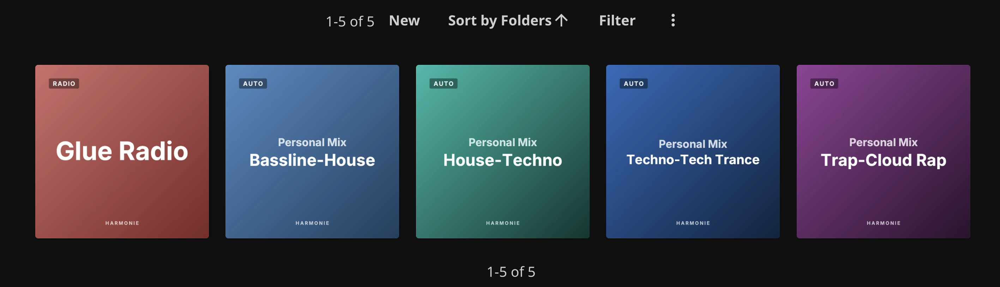

<p align="center">
  
</p>

<h1 align="center">Jellyfin Harmonie</h1>

<p align="center">
  <a href="https://github.com/mxschll/jellyfin-harmonie/actions/workflows/ci.yml">
    
  </a>
</p>

Spotify has Song Radio and Daily Mix. Plex has Sonic Sage. They listen to a track or your recent plays and surface dozens of similar songs from your library. Jellyfin doesn't have anything like that.

Harmonie fills that gap. It's a Jellyfin plugin that fills playlists with similar music, using [harmonie](https://github.com/mxschll/harmonie) for the audio analysis. Name a playlist `[RADIO]` and the plugin fills it with tracks that sound like the ones at the top. Name it `[DRIFT]` and the playlist gradually walks away from the seed. It also generates Personal Mix playlists for each user, one per top style derived from their listening history.

<p align="center">
  
</p>

## Install

The plugin needs a running [harmonie](https://github.com/mxschll/harmonie) service to talk to. Install harmonie first, then the plugin.

### 1. Install harmonie

```bash
pipx install --pip-args='--pre' 'git+https://github.com/mxschll/harmonie.git'
HARMONIE_LIBRARIES=/path/to/music harmonie serve
```

Point it at the same music directories Jellyfin reads. The first scan can take a while on a large library; harmonie analyses each track once and stores the result. See the [harmonie README](https://github.com/mxschll/harmonie#install) for everything else (API key, scan schedule).

### 2. Install the plugin

In Jellyfin go to Dashboard, Plugins, Repositories, and add this URL:

```
https://raw.githubusercontent.com/mxschll/jellyfin-harmonie/main/manifest.json
```

Open the Catalog tab, find Harmonie under Music, and click Install. Restart Jellyfin when prompted. Then open Plugins, Harmonie, and point the plugin at your harmonie server. Harmonie listens on port `8842` by default, so if you ran it on the same machine as Jellyfin the URL is `http://localhost:8842`.

## Use it

Make a normal Jellyfin playlist and prefix the name with `[RADIO]`, `[DRIFT]`, or `[MIX]`. The plugin watches for edits and refreshes the playlist in the background five seconds later.

Radio playlists treat the first N tracks as seeds (N is configurable, default 5). The first seed is the strongest anchor. Drag a track into the top to make it a seed; remove it to demote it.

Drift playlists take one seed (the first track) and walk away from it in chunks. Each chunk is anchored on the last track of the previous chunk, so the playlist evolves in style as it goes. Good for long mixes.

Mix playlists seed themselves from your Jellyfin listening history, so you don't add tracks. Anything you do add gets wiped on the next refresh. The default is "today's mix" from the last week.

You can override settings per playlist with tokens inside the brackets:

| Token | Mode | What it does |
| --- | --- | --- |
| `n=N` | any | playlist length, 1 to 500 |
| `days=N` | mix | listening window, 1 to 365 |
| `top` or `top=N` | mix | seed by play count rank instead of recency |
| `drift` | mix | use drift mode for the expansion |

Examples:

- `[RADIO n=40] Workout`
- `[DRIFT n=50] Long Mix`
- `[MIX top days=30] Heavy Rotation`
- `[MIX drift] Stretch Mix`

## Personal Mix playlists

Optional. When you turn this on, the plugin maintains a fixed number of `Personal Mix · Style` playlists per user, one per top style derived from listening history. As your taste shifts the playlists rename and refill themselves. No orphans, no manual cleanup. Turn it on in plugin settings under "Personal Mix playlists".

## Refresh

The plugin refreshes a playlist five seconds after you edit it. There's also a daily scheduled task ("Refresh Harmonie Playlists" in Dashboard, Scheduled Tasks) that refreshes everything; run it manually from there if you want.

## Compatibility

Works on Jellyfin 10.10 and 10.11. Both ABIs ship in every release; Jellyfin picks the right one for your server.

## License

GPL-3.0.
