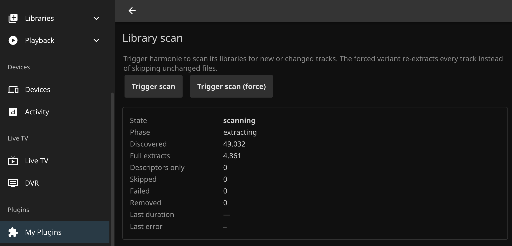

<p align="center">
  
</p>

<h1 align="center">Jellyfin Harmonie</h1>

<p align="center">
  <a href="https://github.com/mxschll/jellyfin-harmonie/actions/workflows/ci.yml">
    
  </a>
</p>

> [!NOTE]
> **Feedback wanted.** If anything in the install steps, settings, or playlist behaviour gets in your way, please open an issue. I want setup to be as painless as possible.

Jellyfin Harmonie generates playlists from your music library using audio similarity and Jellyfin listening history. It replaces Jellyfin's genre- and tag-based Instant Mix selection with tracks matched by the audio itself.

The plugin also provides seeded radio and drift playlists, genre and style playlists, daily mixes, and personal mixes. Audio analysis is provided by the [harmonie](https://github.com/mxschll/harmonie) service.

<p align="center">
  
</p>

## Install

The plugin needs a running [harmonie](https://github.com/mxschll/harmonie) service to talk to. Install harmonie first, then the plugin.

### 1. Install harmonie

Install pipx, then harmonie itself:

```bash
sudo apt install pipx
pipx ensurepath

pipx install --pip-args='--pre' 'git+https://github.com/mxschll/harmonie.git'
HARMONIE_LIBRARIES=/path/to/music harmonie serve
```

Point it at the same music directories Jellyfin reads. The first scan starts automatically. See the [harmonie README](https://github.com/mxschll/harmonie#install) for everything else.

### 2. Install the plugin

In Jellyfin go to Dashboard > Catalog > Repositories (gear icon), and add this URL:

```
https://raw.githubusercontent.com/mxschll/jellyfin-harmonie/main/manifest.json
```

Open the Catalog tab, find Harmonie under Music, and click Install. **Restart Jellyfin**. Then open Plugins > Harmonie, and point the plugin at your harmonie server. Harmonie listens on port `8842` by default, so if you ran it on the same machine as Jellyfin the URL is `http://localhost:8842`. Save the form.

The plugin's settings page shows live harmonie scan progress:

<p align="center">
  
</p>

## Use it

Make a normal Jellyfin playlist with one of these prefixes. The plugin refreshes the contents in the background.

| Prefix | Result |
| --- | --- |
| `[RADIO]` | Similar tracks based on the first five tracks by default. Earlier seeds have more influence. Reorder or remove tracks to change the seeds. |
| `[DRIFT]` | An evolving mix starting from the first track. Each group of results becomes the seed for the next. |
| `[MIX]` | A mix seeded from the user's recent listening history. Manually added tracks are removed. |
| `[GENRE] X` | Tracks classified under a Discogs genre, such as `[GENRE] Hip Hop`. |
| `[STYLE] X` | Tracks classified under a Discogs style, such as `[STYLE] House`. |

Genre and style playlists regenerate daily. See [the supported Discogs genres and styles](docs/discogs-styles.md).

Override settings with tokens inside the brackets:

| Token | Mode | What it does |
| --- | --- | --- |
| `n=N` | any | playlist length, 1 to 500 |
| `days=N` | mix | listening window, 1 to 365 |
| `top` or `top=N` | mix | seed by play count rank instead of recency |
| `drift` | mix | use drift mode for the expansion |
| `style_min=F` | style, genre | minimum classifier probability, 0.0 to 1.0. Defaults to 0.6 (configurable in plugin settings) |

Examples:

- `[RADIO n=40] Workout`
- `[DRIFT n=50] Long Mix`
- `[MIX top days=30] Heavy Rotation`
- `[MIX drift] Stretch Mix`
- `[GENRE] Electronic`
- `[STYLE n=200] House`
- `[STYLE style_min=0.5] Hard Techno`

## Personal Mix playlists

The plugin groups each user's recently played tracks by Harmonie style, weighted by play count, then expands every cluster into a private mix. The number of playlists adapts to the available listening history. As taste shifts, the playlists rename and refill themselves. Enabled by default and refreshed every 30 days; both behavior and schedule are configurable.

## Song Radio / Instant Mix

When you tap "Instant Mix" in the Jellyfin web UI (or "Song Radio" in Finamp) on a track, the plugin returns tracks matched from their audio instead of Jellyfin's genre- and tag-based selection. Works in every Jellyfin client without setup. Falls back to Jellyfin's default behaviour when harmonie is unreachable or the track isn't in its index, so the button always works. Toggle off in plugin settings under "Instant Mix / Song Radio".

Radio, Drift, Mix, Personal Mix, and Instant Mix each have a `0`–`1` variation setting. Higher values produce more varied results while keeping songs similar to the seeds; `0` keeps results deterministic.

## Refresh

The plugin refreshes a playlist shortly after you edit it. Two scheduled tasks run in the background (Dashboard, Scheduled Tasks):

* **Refresh Harmonie Playlists:** daily at 03:00. Rebuilds every `[RADIO]`, `[DRIFT]`, `[MIX]`, `[STYLE]`, and `[GENRE]` playlist.
* **Refresh Harmonie Personal Mix Playlists:** every 30 days. Rebuilds the per-user Personal Mix playlists.

Both schedules can be changed from the same page, and either can be triggered manually.

## Compatibility

Tested on Jellyfin 10.10 and 10.11.

## License

GPL-3.0.
