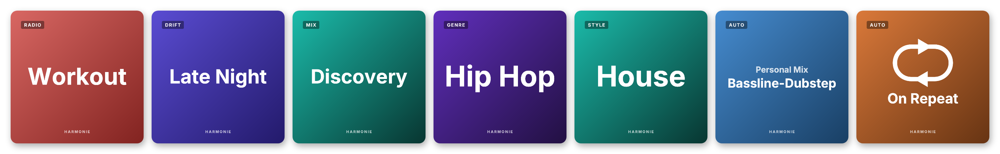
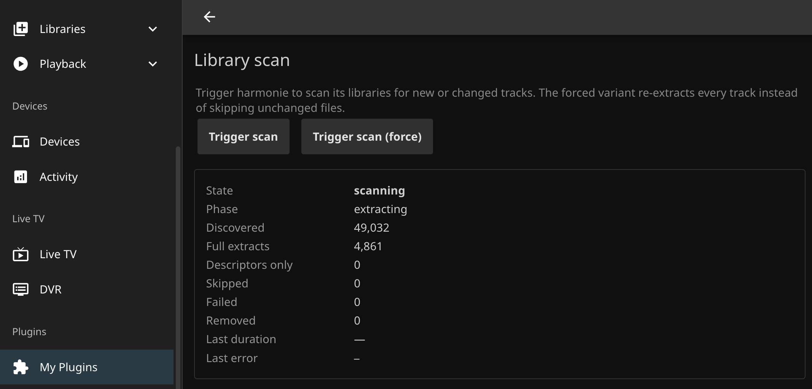

<p align="center">
  
</p>

<h1 align="center">Jellyfin Harmonie</h1>

<p align="center">
  <a href="https://github.com/mxschll/jellyfin-harmonie/actions/workflows/ci.yml">
    
  </a>
</p>

> [!NOTE]
> **Feedback wanted.** If anything in the install steps, settings, or playlist behaviour gets in your way, please open an issue. I want setup to be as painless as possible.

Jellyfin Harmonie generates playlists from your music library using audio similarity and stored listening data. It replaces Jellyfin's genre- and tag-based Instant Mix selection with tracks matched by the audio itself.

The plugin provides personal mixes and On Repeat playlists built from listening habits, plus seeded radio and drift playlists, daily mixes, and genre and style playlists. The [harmonie](https://github.com/mxschll/harmonie) service does the audio analysis.

<p align="center">
  
</p>

## Install

The plugin requires [harmonie](https://github.com/mxschll/harmonie) 1.5.0 or newer. Install harmonie first, then the plugin.

### 1. Install harmonie

Install pipx, then harmonie itself:

```bash
sudo apt install pipx
pipx ensurepath

pipx install --pip-args='--pre' 'git+https://github.com/mxschll/harmonie.git'
HARMONIE_LIBRARIES=/path/to/music harmonie serve
```

Point it at the same music directories Jellyfin reads. The first scan starts automatically. See the [harmonie README](https://github.com/mxschll/harmonie#install) for everything else.

### 2. Install the plugin

In Jellyfin go to Dashboard > Catalog > Repositories (gear icon), and add this URL:

```
https://raw.githubusercontent.com/mxschll/jellyfin-harmonie/main/manifest.json
```

Open the Catalog tab, find Harmonie under Music, and click Install. **Restart Jellyfin**. Then open Plugins > Harmonie, and point the plugin at your harmonie server. Harmonie listens on port `8842` by default, so if you ran it on the same machine as Jellyfin the URL is `http://localhost:8842`. Save the form.

The plugin's settings page shows live harmonie scan progress:

<p align="center">
  
</p>

## Use it

Once harmonie finishes its first library scan, which can take several hours for a large library, Instant Mix works from the first tap. The personal playlists build themselves from listening data, so they appear and grow over the first days of use, as the scheduled tasks run and listening habits accumulate. Run the tasks by hand or change their schedule under Dashboard → Scheduled Tasks; tune the playlists in the plugin settings.

### Song Radio / Instant Mix

When you tap "Instant Mix" in the Jellyfin web UI (or "Song Radio" in Finamp) on a track, the plugin returns tracks matched from their audio instead of Jellyfin's genre- and tag-based selection. Works in every Jellyfin client without setup. Falls back to Jellyfin's default behaviour when harmonie is unreachable or the track isn't in its index, so the button always works. Toggle off in plugin settings under "Instant Mix / Song Radio".

### Personal Mix playlists

The plugin scores each user's recent tracks from plays, completions, skips, favorites, and playlist additions. It groups the strongest tracks by Harmonie style, then expands each group into a private mix. The number of playlists adapts to the available data. Enabled by default and refreshed weekly; both behavior and schedule are configurable.

### On Repeat

One playlist per user with the exact tracks they have played on loop over the last month, most-played first. No similarity expansion — these are the user's own repeats, straight from stored listening data, so it works even when harmonie is down. A track needs at least three plays in the window to qualify, and the playlist first appears once five tracks do. Enabled by default and refreshed daily; toggle it off in plugin settings.

## Prefix playlists

For direct control, make a normal Jellyfin playlist with one of these prefixes. The plugin refreshes the contents in the background.

| Prefix | Result |
| --- | --- |
| `[RADIO]` | Similar tracks based on the first five tracks by default. Earlier seeds have more influence. Reorder or remove tracks to change the seeds. |
| `[DRIFT]` | An evolving mix starting from the first track. Each group of results becomes the seed for the next. |
| `[MIX]` | A mix seeded from the user's recent plays, favorites, and playlist additions. Manually added tracks are removed. |
| <code>[GENRE]&nbsp;X</code> | Tracks classified under a [Discogs genre](docs/discogs-styles.md#genres), such as `[GENRE] Hip Hop`. |
| <code>[STYLE]&nbsp;X</code> | Tracks classified under a [Discogs style](docs/discogs-styles.md#styles), such as `[STYLE] House`. |

Genre and style playlists regenerate daily. See [the supported Discogs genres and styles](docs/discogs-styles.md).

Override settings with tokens inside the brackets:

| Token | Mode | What it does |
| --- | --- | --- |
| `n=N` | any | playlist length, 1 to 500 |
| `days=N` | mix | playback activity window, 1 to 365 |
| `top` or `top=N` | mix | seed from all-time favorites instead of recent plays |
| `drift` | mix | use drift mode for the expansion |
| `style_min=F` | style, genre | minimum classifier probability, 0.0 to 1.0. Defaults to 0.6 (configurable in plugin settings) |

Examples:

- `[RADIO n=40] Workout`
- `[DRIFT n=50] Long Mix`
- `[MIX top days=30] Heavy Rotation`
- `[MIX drift] Stretch Mix`
- `[GENRE] Electronic`
- `[STYLE n=200] House`
- `[STYLE style_min=0.5] Hard Techno`

Radio, Drift, Mix, Personal Mix, and Instant Mix each have a `0`–`1` variation setting. Higher values produce more varied results while keeping songs similar to the seeds; `0` keeps results deterministic.

## Refresh

The plugin refreshes a playlist shortly after you edit it. Two scheduled tasks run in the background (Dashboard, Scheduled Tasks):

* **Refresh Harmonie Playlists:** daily at 03:00. Rebuilds every `[RADIO]`, `[DRIFT]`, `[MIX]`, `[STYLE]`, and `[GENRE]` playlist, plus the On Repeat playlists.
* **Refresh Harmonie Personal Mix Playlists:** weekly. Rebuilds the per-user Personal Mix playlists.

Both schedules can be changed from the same page, and either can be triggered manually.

## Listening data

The plugin stores these signals for each user:

- Jellyfin user and track IDs
- Play count and last play time
- Start and stop times, track length, and playback positions
- Active listening time, without pauses
- Pauses and forward or backward seeks
- Completed plays and early stops
- Favorite tracks
- Tracks in user playlists and when they were added
- Play session, client, and device IDs

The plugin imports Jellyfin's current totals and preferences once. It cannot recover activity from periods when the plugin was disabled or uninstalled.

## How does this compare to AudioMuse-AI?

The shortest answer: they aim at different things. If you know Plexamp's Sonic Analysis or Spotify's Song Radio and Daily Mixes, Harmonie is that for Jellyfin. Radio from a seed track, per-user mixes built from listening history, surfacing forgotten songs. AudioMuse-AI is a broader discovery toolbox.

[AudioMuse-AI](https://github.com/NeptuneHub/AudioMuse-AI) has features Harmonie does not, such as chat-based playlists and text and lyrics search. Its Jellyfin plugin maps the AudioMuse-AI API onto Jellyfin endpoints so client apps can call those features, and clients need to build against that API to use most of them.

Harmonie goes the other way. Everything it produces is an ordinary Jellyfin playlist, created and refreshed by the plugin on the server. That means:

- **Works in every client.** Playlists show up in the web UI, Finamp, Symfonium, downloads, and offline sync like any other playlist. No client needs to know Harmonie exists.
- **Playlists are the interface.** Rename a playlist to change its settings, reorder tracks to change the seeds. The plugin notices the edit and refreshes in the background.
- **Personal, from listening.** The plugin tracks each user's listening data locally (plays, skips, completions, favorites) and builds per-user Personal Mixes from it that rename and refill themselves as taste shifts.

Pick AudioMuse-AI if you want its breadth of discovery tools and use a client that integrates them. Pick Harmonie if you want similarity-based playlists that live natively in Jellyfin and follow each user's listening.

## Compatibility

Tested on Jellyfin 10.10 and 10.11. 12 coming.

## License

GPL-3.0.
